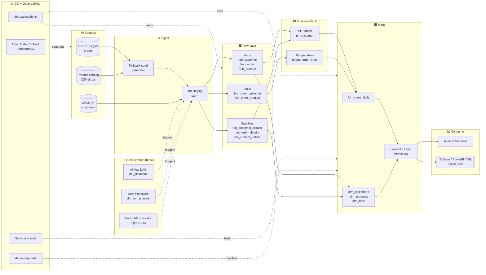

# dbt-datavault-snowflake-bigquery-observability

Production-grade **Data Vault 2.0** analytics platform on **dbt** with **multi-adapter** support (Snowflake, BigQuery, and DuckDB for hermetic CI), orchestrated by three parallel schedulers (**Airflow**, **AWS Step Functions**, and a **Control-M simulator**), with **elementary-data** observability, **dbt-expectations** data quality, a **PySpark seed generator**, and an **Apache Superset** BI layer.

CI runs `dbt seed → run → test → docs generate` against **DuckDB** — no cloud credentials, zero dollar cost, green on first push.


---

## Architecture



See [`docs/architecture.md`](docs/architecture.md) for full sequence diagrams (dbt run lifecycle, DV load sequence, and orchestrator comparison).

---

## Tech highlights

| Layer | Technologies |
|---|---|
| **Modeling** | **Data Vault 2.0** (hand-rolled macros, adapter-agnostic): hubs, links, satellites, PIT, bridge |
| **Transformation** | dbt Core 1.8 (unit tests, contracts, versions, exposures, semantic layer) |
| **Warehouses** | Snowflake (prod), BigQuery sandbox (stage), **DuckDB** (CI), Postgres (dev) |
| **Data Quality** | dbt-expectations, dbt_utils tests, native dbt unit tests, custom generic tests |
| **Observability** | elementary-data integration, dbt artifacts upload, source freshness, OpenLineage emitter |
| **Contracts** | Open Data Contract Standard (ODCS v3) for every source |
| **Orchestration** | Airflow 2.8 DAG, Step Functions ASL, Control-M simulator (bash + authentic JSON job defs) |
| **Ingestion** | PySpark seed generator producing realistic multi-table fixtures |
| **BI** | Superset dashboards (Tableau/PowerBI/Qlik exportable) |
| **CI/CD** | GitHub Actions (dbt build + sqlfluff + python lint), Jenkinsfile, GitLab mirror |

---

## Quickstart

```bash
make install
make lint           # ruff + sqlfluff + yamllint
make dbt-ci         # dbt deps + seed + run + test on DuckDB (no creds)
make docs           # dbt docs generate + serve
make compose-up     # Postgres + Superset + elementary UI
make airflow-up     # local Airflow for DAG demo
make controlm-sim   # simulate Control-M job definitions
```

---

## Project layout

```
dbt-datavault-snowflake-bigquery-observability/
├── .github/workflows/ci.yml
├── Makefile, Jenkinsfile, .gitlab-ci.yml
├── dbt_project.yml, packages.yml, profiles/profiles.yml
├── docs/                    # architecture, design decisions, DV guide, BI export notes
├── airflow/dags/            # dbt_datavault, dbt_refresh_marts
├── step_functions/          # ASL state machines
├── control_m/               # authentic job JSON + bash simulator
├── models/
│   ├── staging/             # stg_orders, stg_customers, stg_products
│   ├── raw_vault/           # hubs/, links/, satellites/
│   ├── business_vault/      # pit/, bridge/
│   ├── marts/               # fct_* + dim_* + dim_date
│   └── semantic/            # MetricFlow YAML (sales, customers)
├── macros/                  # hash_key, hash_diff, generate_schema_name
├── seeds/                   # CSV seeds used by DuckDB CI + Snowflake/BQ dev
├── snapshots/               # SCD2 snapshot definitions
├── tests/                   # generic + singular + unit (native dbt 1.8 YAML)
├── analyses/                # ad-hoc analyses for documentation
├── exposures/               # downstream consumers (Superset, Tableau)
├── spark/                   # PySpark seed generator
├── superset/                # dashboards + datasets
└── scripts/                 # helpers
```

---

## Zero-cost posture

| Production warehouse | Local substitute | Prod config? |
|---|---|---|
| Snowflake | dbt-duckdb in CI | `profiles/profiles.yml` includes snowflake target, with prod docs |
| BigQuery | dbt-duckdb in CI | same — bigquery target documented, sandbox-compatible |
| Redshift | Postgres / DuckDB | compatibility notes in `docs/warehouses.md` |

---

## License

MIT.
