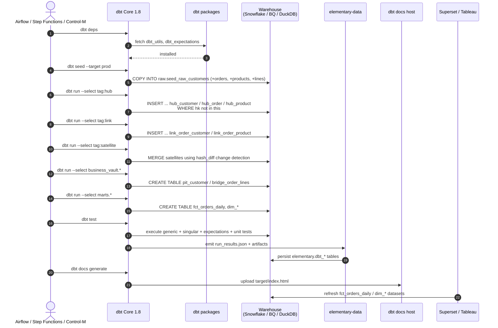
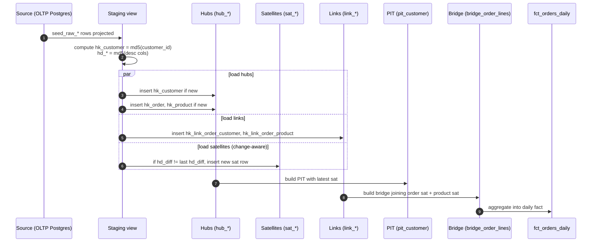
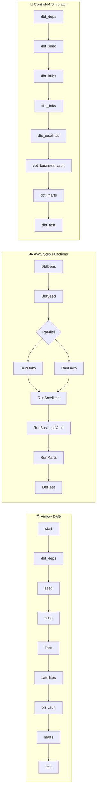
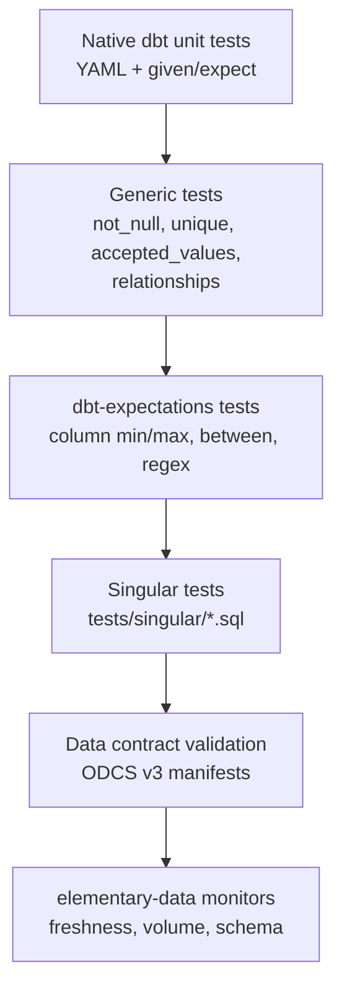

# Architecture — Sequence & State Diagrams

## 1. dbt run lifecycle (end-to-end)

---

## 2. Data Vault load sequence (single batch)

---

## 3. Triple-orchestrator comparison

The same dbt invocations are orchestrated by all three engines. Choose one per environment:
- **Airflow** for cloud-native teams with Python-heavy ecosystems
- **Step Functions** for AWS-native serverless deployments
- **Control-M** for enterprise / regulated environments with existing CTM estate

---

## 4. Test pyramid

